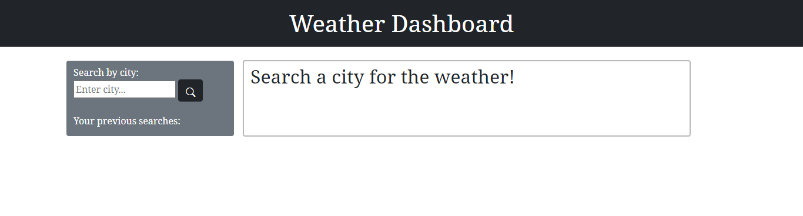
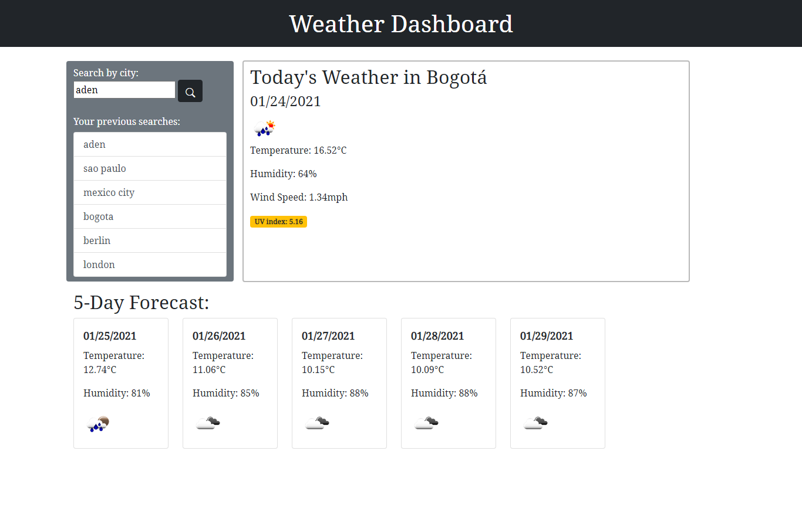
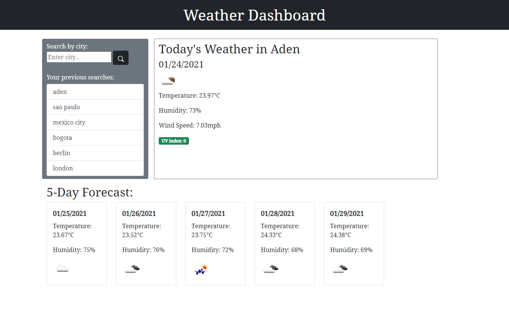

# Weather Dashboard

## Description 

This application allows the user to search any city and recieve the weather information for that city. It also provides the UV index of searched city with colours depicting whether they are favourable, moderate or severe. Features of this project include:
* JavaScript with jQuery
* APIs
* Dynamically created content
* Responsive design
* Use of local storage

## Credits
* 
* 
* 

## Screenshots

Here is the page on first load:

With clickable a search history list:

And returning the last searched city weather information on refresh of the page:

## URL

[Deployed URL](https://alishasaleh.github.io/weather-dashboard/)

## License

Standard MIT License

